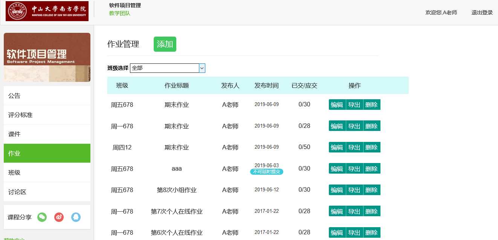

# 在线学习网站

此项目是基于 PHP + Apache + Mysql + Layui 搭建的教学辅助网站。

## 概述
软件项目学习管理系统是一个方便教师与学生进行软件项目管理课程的学习与交流的软件。系统涵盖了基本操作，教师操作板块和学生操作板块。
- 教师对班级的管理权限、公告发布编辑功能、教学团队查找功能、课件上传、评分标准设置以及作业评分功能；
- 学生可查看班级、公告、评分标准等信息，可进行作业提交，还可以进行课件资料以及已提交作业下载。
  

## 功能需求

+	课程资源
    + 关于教学大纲，课件和实践指导书，可以进行分类管理。
    + 关于课件，可以是文档，也可以是视频文件。
须实现上传，删除，在线编辑功能。
+	教学团队
    + 课程创建的老师，可以邀请其他已注册的老师加入教学团队。其他老师也自己可以申请加入。
+	学生管理
    + 关于注册，账号和密码需要有长度和内容的限制。
关于班级管理，指教师可以创建班级，学生申请加入课程时可以选择加入具体的班级。
教师可以从班级中删除学生，可以把某个（些）同学从一个班级移动到另外一个班级。
+	教师管理
    + 关于注册，账号和密码需要有长度和内容的限制。教师可以登录系统后，可以进行作业管理：包括布置作业；修改保存作业；批改作业；给出评语和成绩；查看、修改评语与成绩；导出成绩。成绩可以是百分制，也可以是五级制（A，B，C，D，E），不能是其它格式。
    + 关于考勤管理，教师可以基于班级名单进行点名，1 表示到课；2表示旷课，3表示迟到，4表示请假。
    + 关于课堂加分，课堂上回答问题，或者课堂实践时表现优秀，可加分，具体内容包含：姓名，学号，日期，成绩
    + 关于课程实践评分，具体内容含：评分标准（最多250字），学号，姓名，成绩，点评。课程实践成绩可以录入，修改，保存，查询，全部导出。
## 性能需求
+ 用户数：80-150人
+ 响应时间：150人同时访问时不超过3秒
## 主要功能截图
+ 公告页
   
+ 课件页
   
+ 作业页
   
+ 班级页
   
+ 讨论区
   
+ 登陆页
   
## 技术栈

【前端】

+ HTML/CSS/JS：亘古不变三件套
+ ES6：ECMAScript 新一代语法，这也是以后的趋势
+ jQuery：主要用到 jQuery 的 ajax 方法处理异步请求和 DOM 操作
+ Layui：样式好看，用起来方便，主要在动态表格中用到
+ Bootstrap：页面 UI 框架，天然响应式，但是样式烂大街
  

【后端】

+ php：动态交互的服务器端脚本语言，本项目没有用到php框架，纯原生，主要用于数据库操作，响应并返回要用到的数据
+ Apache：跨平台，Web服务器；


【数据库】

+ Mysql：一个关系型数据库管理系统


## TODO
- [x] 用户登录注册表单校验
- [ ] 修改Linux bulid步骤
- [ ] 课程考勤管理失效
- [ ] 用vue.js重写
- [ ] 重写讨论区的数据库结构
- [ ] 增加锚URL
- [ ] 登陆session
- [ ] 作业提交显示已交，修改操作变灰
- [ ] 作业评语
- [ ] 作业状态
- [ ] ....


## Build Setup
### windows

```
#安装
WampServer 或 phpStudy

#下载 
https://github.com/trebleC/scholat.git

#把下载好的文件放入安装路径的www目录中
#启动服务器

#加载文件中的 software_eng.sql 的数据库文件

#打开
https://localhost/scholat/index.html

```
### Linux
```
# clone the repo into your disk.
$ git clone https://github.com/trebleC/scholat.git

# install dependencies
$ npm install

# run
$ npm start

# visit
$ http://localhost/scholat/index.html
```


## License

The code is available under the [Apache License 2.0](LICENSE.txt).


## Thanks
[@lannooo](https://github.com/lannooo) 感谢lannooo的项目，得到参考，里面的文档模板相当好用，项目传送门→[SETA_system](https://github.com/lannooo/SETA_system)

